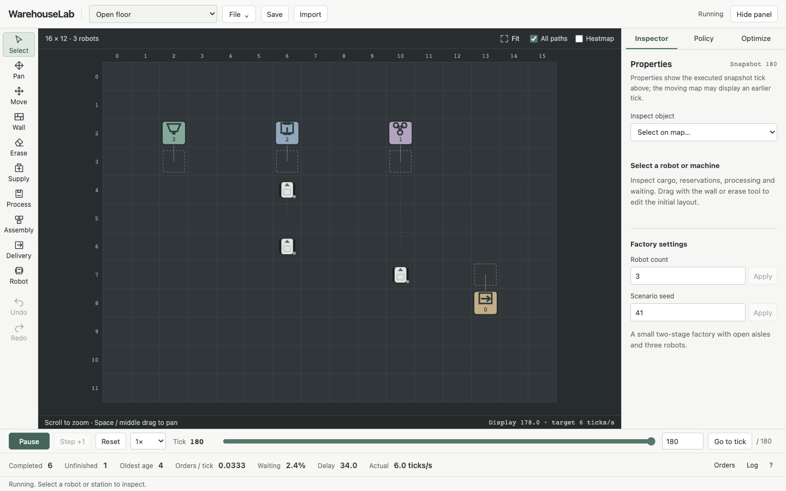

# Using WarehouseLab

## Start a factory

Open [WarehouseLab online](https://yeopbong.github.io/warehouselab/) in a modern browser. No account, installation, or API key is needed; simulation and policy search run in your browser. **Open floor** is ready at tick 0. Press **Start**, then use **Pause** and the timeline to inspect executed ticks. Choose **Policy** to adjust dispatch and routing or **Optimize** to evaluate configurations.

For local use, install **Node.js 22.12 or newer** and npm, then run from the project directory:

```sh
npm ci
npm run dev
```

Open the URL printed by Vite, normally [http://127.0.0.1:5173](http://127.0.0.1:5173). The online and local versions use the same application and simulation kernel. At **1× = 6 ticks/second**, robots move slowly enough to follow; select a faster setting to see production sooner. Click a robot or machine to inspect it.

```text
1 raw ── press: 5 ticks ──> 1 part
2 parts ── assemble: 9 ticks ──> 1 product ── transport/unload ──> delivered order
```

An order completes only after its finished product reaches the delivery service cell and finishes unloading.



## Workbench controls

- **Navigate.** Scroll to zoom at the pointer. Hold Space and drag, use the middle mouse button, or choose Pan. Fit restores the whole factory. Clicking an animated robot selects its displayed position and stable ID. Only the selected robot's planned route is shown by default; All paths and Heatmap are optional.
- **Edit.** Choose Wall or Erase and drag a continuous stroke. Place a supply, process, assembly, delivery station or robot with its tool. Move a selected robot or station; a station's body and service cell move together. The preview shows invalid placement. Entering an edit tool pauses and shows the **initial layout**; one completed gesture validates, resets to tick 0 and creates one undo entry. Undo/Redo retain 50 edits. Escape, tool changes and scene changes cancel an unfinished gesture.
- **Inspect and configure.** The collapsible properties panel shows tasks, cargo, waiting, stock, reservations and processing. It labels the exact executed snapshot tick; animation may display an earlier tick. Looking at an object or switching panels does not reset the run. Numeric fields accept temporary empty/multi-digit drafts. Press Apply or Enter to commit; invalid input keeps the current run intact. Policy changes apply together with **Apply policy & reset**.
- **Save.** File contains New scene, Save locally, Restore, Export JSON and Import JSON. JSON includes a validated scene and policy; local storage retains one factory in this browser. New scene starts empty with the two example recipes; adding a delivery station also adds a small fixed order.
- **Play and replay.** Start/Pause, Step +1, Reset and speed controls use the same kernel. Pause confirms an exact executed tick. The timeline seeks among already executed ticks, coalesces drag requests, and uses bounded checkpoints. Newer requests supersede older seeks. Editing or applying a policy resets the replay range.
- **Inspect detail.** Bottom metrics include completed and unfinished orders, oldest unfinished age, throughput and waiting. Orders and Log open an on-demand drawer; exports retain all orders and the kernel's bounded 400-event log. About & diagnostics contains code versions, actual tick/s, checkpoint counts and shortcuts.

Shortcuts outside text fields: **V** select, **H** pan, **W** wall, **E** erase, **M** move, **Esc** select, **Ctrl/⌘ Z** undo, **Shift Ctrl/⌘ Z** redo, **Ctrl/⌘ S** save. Space is reserved for map panning and does not hijack text input.

Local saves belong to this browser and site; they do not synchronize between the online version, localhost, or other devices. Export JSON to keep a portable copy or share a factory. Refreshing starts the example again; choose **File → Restore** to load your saved factory.

The desktop layout fits 1440×900 and 1280×800 without scrolling the page. Long properties scroll internally. On narrow screens the properties panel starts collapsed and opens over the map.

Normal animation interpolates adjacent, already executed ticks. It never follows an unexecuted planned path or draws a shortcut across several ticks. Above 8×, with reduced motion, or after background resume, the display uses real discrete samples. If computation cannot meet the requested speed, actual tick/s drops; the simulation does not skip ticks. Replay keeps 24 checkpoints including tick 0. Seeking before evicted checkpoints can require more computation.

## Search and compare

**Optimize → Current factory** is the default. Starting a search freezes the current edited scene, its order seed, horizon, parameter ranges and code/kernel version. **Benchmark set** explicitly evaluates the first three built-in maps. Each candidate costs one actual simulation per map × seed: one call in the default current-factory UI, three in the benchmark UI.

Choose Random search or Mixed-variable GA, set a simulation budget and horizon, then Start search. The browser defaults to six calls and a 240-tick horizon. Both methods start with the same two counted human policies. Progress shows actual calls, proposals, cache hits and compact best results. Cancel is handled at cooperative tick boundaries, including within a long candidate or comparison; already started partial calls remain counted and cannot become the best result. A single expensive tick must finish before cancellation is acknowledged.

**How configurations are evaluated.** Each policy runs from tick 0 on the frozen maps and seeds for the same horizon. The primary score is mean `completedOrders / horizon`. Ties prefer fewer unfinished orders, then a lower traffic-waiting ratio; canonical configuration order makes any remaining tie deterministic. Delays and stalls are diagnostics, not extra score penalties. Only complete evaluations can win; collision or material-conservation failures stop the search.

**How proposals are made.** Random search samples the legal categorical choices, integer ranges and continuous congestion weight shown below. The GA first fills a population, including the two presets: three candidates in the browser and default/`--quick` benchmark, or six with `--full`. It then uses two-way tournament selection, uniform categorical/integer inheritance, arithmetic crossover for the continuous weight, bounded mutation and one retained elite per complete generation. Distance routing always normalizes its inactive congestion weight to zero. Both methods use independent caches and count actual simulation calls.

A small budget may finish before the GA produces offspring. Without cache reuse, the browser's initial population costs three calls on one map or nine on the three-map set; allow additional calls to explore offspring. The recorded experiments used small budgets and do not demonstrate that GA outperforms the supplied presets.

Results retain their full frozen scope and scenario hashes. **Baseline** and **Queue aware** are supplied presets; a search candidate can be either of those presets or a newly proposed configuration. Selection alone is not evidence of improvement. Editing later does not relabel an old score as a new-map result. **Apply candidate to current factory** applies only the policy and restarts the currently shown layout and seed. **Compare baseline vs candidate** reruns both from that same current layout and seed, using the displayed comparison horizon. It does not compare a historical training score to a new run. Export best/results/comparison to reproduce the recorded conditions. Imported policies are marked as imported, without invented training provenance.

Superseded calculations emit separate retired accounting records. About & diagnostics can export a bounded archive of three previous/retired results, including cancelled partial calls, while late messages cannot overwrite the active factory.

## Policy parameters and task priority

| Parameter | Type / range | Actual effect |
| --- | --- | --- |
| `assignment` | `nearest` / `earliest` | Nearest dispatches an idle robot by Manhattan pickup distance. Earliest estimates remaining service, active task, up to two queued commitments and their endpoint; it is an approximation, not a traffic schedule. |
| `priority` | `fixed` / `waiting` | Robot planning order uses stable robot ID or consecutive traffic-wait age, with stable ID ties. |
| `routing` | `distance` / `congestion` | A* action cost is 1, or 1 plus a nonnegative observed-density cost. Safety rules are identical. |
| `congestionWeight` | continuous, 0–5 | Scales density cost; normalized to 0 when distance routing is chosen. |
| `planningWindow` | integer, 4–32 ticks | Limits space-time search; a static obstacle-aware distance field guides safe partial paths around detours. |
| `replanInterval` | integer, 1–8 ticks | Reuses a path only while its goal, policy, geometry and reservations remain valid; invalid paths replan immediately. |

Baseline: `nearest / fixed / distance / 0 / 12 / 3`. Queue aware: `earliest / waiting / congestion / 1.5 / 16 / 2`. Neither is guaranteed to be best.

**Order priority is separate from robot traffic priority.** Executable deliveries are considered globally by order arrival, then stable order ID, across all delivery stations. Missing stock, unavailable capacity or static disconnection for one old order does not block other executable deliveries or upstream production inputs. Robot, pickup and destination must share a static connected component; traffic reservations still decide safe movement. `oldestUnfinishedAge` reports backlog age; completed-order delay alone can hide unserved demand. Conservative prioritized planning can still stall interacting robots on arbitrary maps; it does not guarantee deadlock freedom.

## Validation and command-line runs

```sh
# Type check, tests, production build and quick benchmark
npm run validate

# Production browser workflows
npx playwright install chromium
npm run test:e2e

# A single shared-kernel run
npm run headless -- --scenario open-floor --policy baseline --seed 11 --ticks 240

# An imported scene and configuration
npm run headless -- --input scenarios/open-floor.json --config configs/queue-aware.json --ticks 600

# Fixed three-map benchmark; 18 actual training calls per method
npm run benchmark -- --quick

# Larger fixed-set run, including three independent optimizer seeds
npm run benchmark -- --full

# Optimize one saved factory, with the same conditions for both methods
npm run benchmark -- --input scenarios/open-floor.json --horizon 240 --budget 6

# Sustained demand, no warm-up exclusion; 12 robots, same budget per method
npm run benchmark -- --sustained --horizon 600 --budget 4
```

`npm run build` writes `dist/`; `npm run preview` serves it. The application supports [Vite static hosting](https://vite.dev/guide/static-deploy.html). CI runs installation, type checking, tests and a production build, with a separate Chromium workflow job. Use `PW_CHANNEL=chrome npm run test:e2e` to run tests with installed Chrome. `PW_BASE_URL` may point browser tests at an existing production preview.

Run records retain scene content/hash, configuration, seed, horizon, counts, backlog/delay/waiting/stall diagnostics, timing, state hash and code/kernel version. Version labels are the current short Git commit plus `-dirty` when needed; Vite captures the label at build/start time. Kernel version is `1.1.0`. Hashes are compact noncryptographic identifiers; caches do not depend on hash collision resistance. Wall-clock diagnostics are excluded from deterministic comparison.

## Benchmark conditions

The fixed training set is Open floor, Crossroads and Hotspot dispatch. Held-out offset floor remains excluded from selection. The benchmark freezes one choice from training, then runs it and a matched baseline on the held-out map; these extra calls are reported separately. Current-factory and sustained modes do not silently evaluate an unrelated held-out map.

| Preset benchmark | Horizon | Evaluation seeds per map | Training calls per method / optimizer seed | Optimizer seeds |
| --- | ---: | --- | ---: | --- |
| `--quick` | 240 | 11 | 18 | 7 |
| `--full` | 600 | 11, 29, 47 | 144 | 7, 19, 43 |

The quick fixed-set run uses **38 actual calls**: 18 random + 18 GA + 2 matched held-out runs. Full mode uses 864 training calls plus the 2 held-out calls. Human starting candidates count in those budgets. A candidate on three maps × three seeds costs nine calls. Caches are independent and bounded; proposal limits terminate repeated-candidate sequences. Failed, cancelled and incomplete records stay explicit.

**Finite batches versus sustained demand:** the original maps retain their finite order batches. Some can finish every order by 600 ticks, so end-of-horizon throughput then cannot distinguish earlier completion. **Sustained production** adds 12 robots, three production cells and 2,000 seeded orders at five-tick intervals, covering approximately the first 10,000 ticks. The 600/1,200-tick checks keep receiving demand throughout; horizons beyond the stream coverage eventually include a finite tail. No warm-up period is discarded: every completion through the common horizon counts for all methods. The scene and stream never change to favor an optimizer.

Historical kernel 1.0.0 [37-call smoke results](../results/smoke/summary.md) use different kernel semantics. The kernel 1.1.0 [38-call quick run](../results/revision-smoke/summary.md) matched baseline throughput. In the [8-call sustained run](../results/revision-sustained/summary.md), both optimizers selected the supplied queue-aware policy; neither found a better policy than both human starting candidates. Source versions and limitations are recorded in [validation](validation.md) and [performance](performance.md); small runs do not establish statistical or generalization advantages.

See [design](design.md) for the kernel and search architecture, [planning notes](planning-notes.md) for route and task semantics, and [third-party sources](../THIRD_PARTY.md) for dependencies and references.
